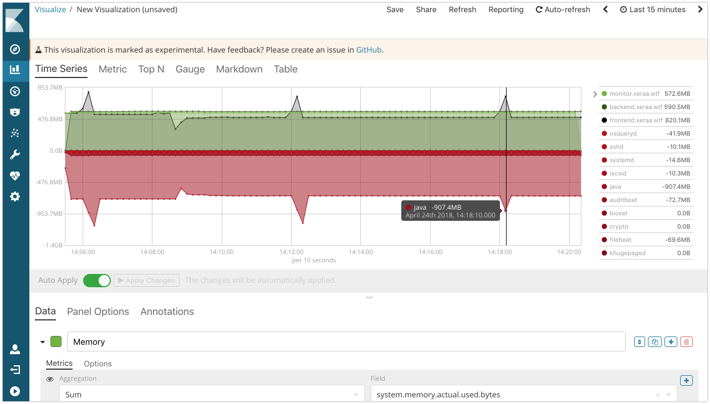
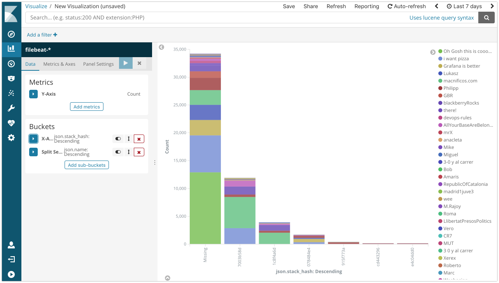
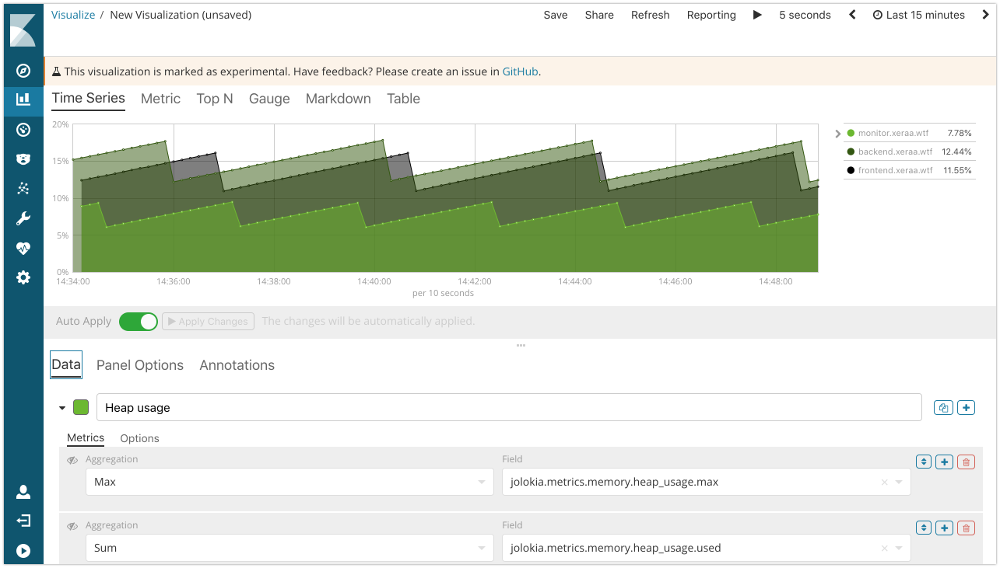
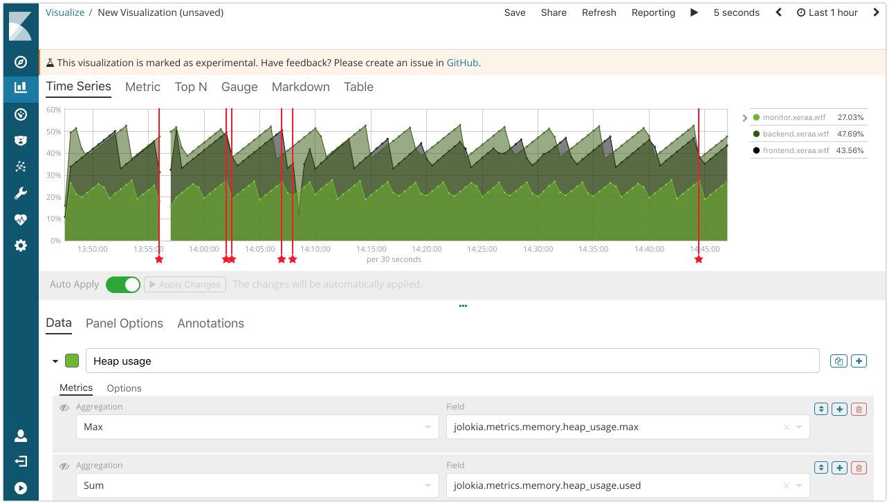

# Microservice Monitoring

Monitor logs, metrics, pings, and traces of your distributed (micro-) services. There are also [slides](https://speakerdeck.com/xeraa/360-degrees-monitoring-of-your-microservices) walking you through the features of this repository.

## Features

* **X-Pack Monitoring**: Start the overview page to show the systems we are using for monitoring.
* **Metricbeat System**: Show the *[Metricbeat System] Overview* dashboard in Kibana and then switch to *[Metricbeat System] Host overview*. If you show all hosts, you will see little spikes approximately every 5 minutes — this is a rogue process we are running with a cron job and we want to find it.
* Build an overview with the Time Series Visual Builder:
  * A sum over the field `system.memory.actual.used.bytes` and group by the term `beat.name`.
  * A sum over the field `system.process.memory.rss.bytes` and group by the term `system.process.name`. Optionally move this visualization to the negative axis to make it easier to visualize with a calculation on `params.process*-1` (`process` is your variable name).

* **Packetbeat**: Show the *[Packetbeat] Overview*, *[Packetbeat] Flows*, and *[Packetbeat] HTTP* dashboard, let attendees hit */*, */good*, */bad*, and */foobar* a few times, and see the corresponding graphs. In *Discover* you can point out the process enrichment for nginx, Java, and the APM server. Optionally show the *[Packetbeat] TLS Sessions* and *[Packetbeat] DNS Tunneling* dashboards as well.
* **Filebeat modules**: Show the *[Filebeat Nginx] Access and error logs*, *[Filebeat System] Syslog dashboard*, *[Filebeat System] SSH login attempts*, and *[Osquery Result] Compliance pack* dashboards.
* **Filebeat**: Let attendees hit */good* with a parameter and point out the MDC logging under `json.name` and the context view for one log message. Let attendees hit */bad* and */null* to show the stacktrace both in the JSON log file and in Kibana by filtering down on `application:java` and `json.severity: ERROR`. Also point out the cloud `meta.*` and `host.*` information. And show the `json.stack_hash`, which you can use for visualizations too.

* **Auditbeat**: Show changes to the */opt/* folder with the *[Auditbeat File Integrity] Overview* dashboard.
* **Heartbeat**: Run Heartbeat and show the *Heartbeat HTTP monitoring* dashboard in Kibana, then stop and start the frontend application with `ansible-playbook restart_frontend.yml` or do it manually and see the change.
* **Metricbeat nginx**: Show the *[Metricbeat Nginx] Overview* dashboard.
* **Metricbeat HTTP**: Show */health* and */metrics* with cURL (credentials are `admin` and `secret`). Then collect the same information with Metricbeat's HTTP module and show it in Kibana's Discover tab.
* **Metricbeat JMX**: Display the same */health* and */metrics* data and its collection through JMX.
* **Visual Builder**: Build a more advanced visualization with the Time Series Visual Builder, for example to show the heap usage in percent by calculating the average of `jolokia.metrics.memory.heap_usage.used` divided by the max of `jolokia.metrics.memory.heap_usage.max`.

* **Annotations**: Include the deployment *events* as an annotations.

* **APM**: Show the traces so far. Then let the attendees hit */call* and */call-bad* to see where the slowness is coming from and how errors look like. If there is not enough activity on the instances, call `./ab.sh` on the monitor instance.
* **Kibana Dashboard Mode**: Point attendees to the Kibana instance to let them play around on their own.

## Setup

If the network connection is decent, show it on [Amazon Lightsail](https://amazonlightsail.com). Otherwise fall back to the local setup and have all the dependencies downloaded in advance.

### Lightsail

Make sure you have run this before the demo, because some steps take time and require a decent internet connection.

1. Make sure you have your AWS account set up, access key created, and added as environment variables in `AWS_ACCESS_KEY_ID` and `AWS_SECRET_ACCESS_KEY`. Protip: Use [https://github.com/sorah/envchain](https://github.com/sorah/envchain) to keep your environment variables safe.
1. Create the Elastic Cloud instance with the same version as specified in *variables.yml*'s `elastic_version`, enable Kibana as well as the GeoIP & user agent plugins, and set the environment variables with the values for `ELASTICSEARCH_HOST`, `ELASTICSEARCH_USER`, `ELASTICSEARCH_PASSWORD`, as well as `KIBANA_HOST`, `KIBANA_ID`.
1. Change into the *lightsail/* directory.
1. Change the settings to a domain you have registered under Route53 in *inventory*, *variables.tf*, and *variables.yml*. Set the Hosted Zone for that domain and export the Zone ID under the environment variable `TF_VAR_zone_id`. If you haven't created the Hosted Zone yet, you should set it up in the AWS Console first and then set the environment variable.
1. If you haven't installed the AWS plugin for Terraform, get it with `terraform init` first. Then create the keypair, DNS settings, and instances with `terraform apply`.
1. Open HTTPS on the network configuration on all instances and TCP 8200 on the monitoring instance (waiting for this [Terraform issue](https://github.com/terraform-providers/terraform-provider-aws/issues/700)).
1. Apply the base configuration to all instances with `ansible-playbook configure_all.yml`.
1. Apply the instance specific configuration with `ansible-playbook configure_monitor.yml` — frontend and backend don't have specific configurations.
1. Deploy the JARs with `ansible-playbook deploy_bad.yml`, `ansible-playbook deploy_backend.yml`, `ansible-playbook deploy_frontend.yml`, and `ansible-playbook deploy_zipkin.yml` (Ansible is also building them).

When you are done, remove the instances, DNS settings, and key with `terraform destroy`.

### Workshop

Very similar to the Lightsail setup above. The main difference is that everything is running on one instance and you need to open the port 5601 for Kibana (Elasticsearch, APM,... are only accessible on localhost).

Credentials:

* SSH: `ssh elastic-admin@workshop-<number>.xeraa.wtf` elastic-admin / secret
* Elasticsearch: `http://localhost:9200` admin / secret
* Kibana: `http://workshop-<number>.xeraa.wtf:5601` admin / secret

### Local

Make sure you have run this before the demo, because some steps take time and require a decent internet connection.

1. Change into the *local/* directory.
1. Run `docker-compose up`, which will bring up Elasticsearch, Kibana, and all the Beats.
1.
1.
1. Run the Java applications from their directories with `gradle bootRun`.
1.

When you are done, stop the Java applications and remove the Docker setup with `docker-compose down -v`.

## Todo

* Upgrade the base image and osquery
* https://codecentric.github.io/chaos-monkey-spring-boot/
* Micrometer / http://docs.spring.io/spring-boot/docs/current/reference/html/production-ready-metrics.html
* Custom actuator endpoint
* MySQL or MongoDB on the backend with TCP Heartbeat monitoring
* Docker
* Improve traced methods and add async
* https://www.elastic.co/guide/en/logstash/current/plugins-outputs-cloudwatch.html (https://aws.amazon.com/about-aws/whats-new/2017/09/amazon-route-53-announces-support-for-dns-query-logging/ etc)
* https://github.com/elastic/examples/blob/master/Alerting/Sample%20Watches/errors_in_logs/watch.json
